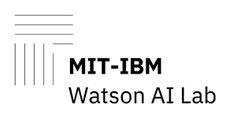

 
<h1>Yue Meng</h1>
<picture><source media="(prefers-color-scheme: dark)" srcset="https://readme-typing-svg.demolab.com/?font=JetBrains+Mono&size=18&pause=1400&color=E8E8E6&center=true&vCenter=true&width=600&height=40&lines=Research+Scientist%2C+Robotics+%40+Apple;Signal+Temporal+Logic+%C3%97+Diffusion+Policies;MIT+REALM+Lab+alum" /></picture>
<a href="http://mengyuest.github.io">mengyuest.github.io</a> &nbsp;·&nbsp; <a href="mailto:mengyuethu@gmail.com">mengyuethu@gmail.com</a>

 

Research Scientist on Apple's Robotics team, working where learning meets formal guarantees — Signal Temporal Logic, diffusion policies, and graph-encoded flow matching for long-horizon planning.  PhD from MIT AeroAstro (REALM Lab, advised by Chuchu Fan), by way of a master's at UC San Diego and an undergrad at Tsinghua.  Off the page, most Sundays find me on a soccer pitch.
 

 

EDUCATION &amp; INDUSTRY COLLABORATIONS  
&nbsp;&nbsp;&nbsp;&nbsp;&nbsp;&nbsp;&nbsp;&nbsp;&nbsp;&nbsp;&nbsp;&nbsp;&nbsp;&nbsp;&nbsp;&nbsp;

 

> Old habit — everything eventually gets written as a spec:
>
> $\Box(\text{explore} \land \text{formalize}) \;\land\; \Diamond(\text{ship robust policy})$
>
> always keep exploring and formalizing, and eventually ship something that survives outside the lab.

 

### Representative work

<b>TeLoGraF</b> &nbsp;<i>ICML 2025</i> graph-encoded flow matching solves general STL specs across systems — one policy for all of them  $\big(\Diamond_{[t_1,t_2]}O_1 \lor \Diamond_{[t_3,t_4]}O_2\big) \land \Box\lnot O_3$  <a href="https://arxiv.org/abs/2505.00562">arXiv</a> · <a href="https://github.com/mengyuest/TeLoGraF">code</a>
 

 

<b>pSTL-Diffusion-Policy</b> &nbsp;<i>RA-L / ICRA 2025</i> diffusion policies for driving whose diversity is shaped by the STL spec itself, not sampled noise  e.g. speed limit · track lanes · keep safe distance  <a href="https://github.com/mengyuest/pSTL-diffusion-policy">code</a>
 

 

<b>STL Neural Predictive Control</b> &nbsp;<i>RA-L / ICRA 2024</i> the task spec is literally the training signal for the controller  e.g. avoid the obstacle, respect joint limits, reach the box  <a href="https://arxiv.org/abs/2309.05131">arXiv</a> · <a href="https://github.com/mengyuest/stl_npc">code</a>
 

 

Earlier: <a href="https://github.com/mengyuest/AdaFuse">AdaFuse</a> (ICLR 2021) · <a href="https://github.com/mengyuest/AR-Net">AR-Net</a> (ECCV 2020) · <a href="https://github.com/mengyuest/SIGNet">SIGNet</a> (CVPR 2019)

 

<!-- activates once .github/workflows/snake.yml has run at least once and created the `output` branch -->

<picture><source media="(prefers-color-scheme: dark)" srcset="https://raw.githubusercontent.com/mengyuest/mengyuest/output/github-contribution-grid-snake-dark.svg" /></picture>

 

<a href="http://mengyuest.github.io">site</a> &nbsp;·&nbsp; <a href="mailto:mengyuethu@gmail.com">email</a>

